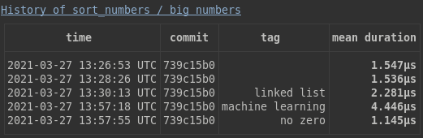
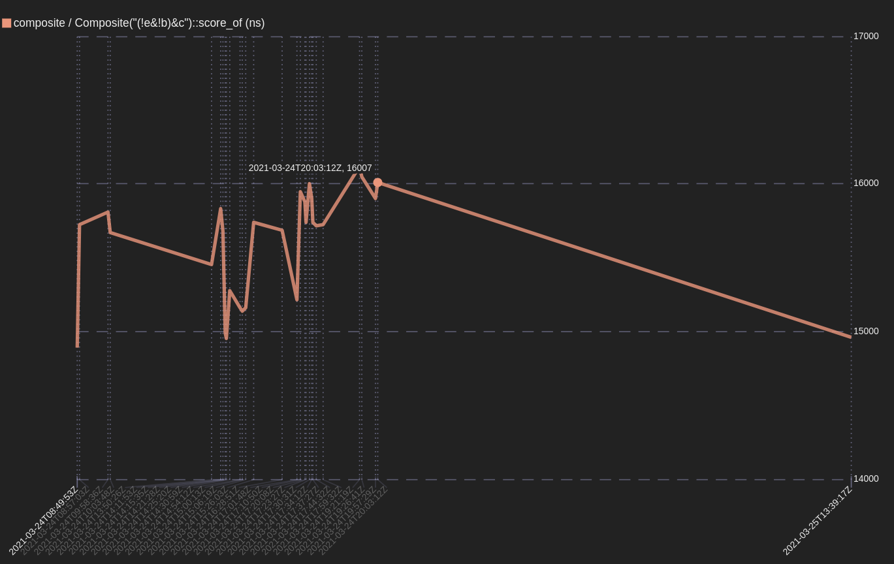
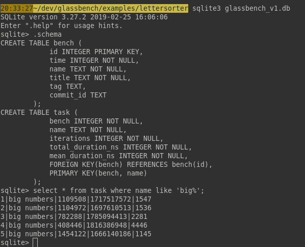

[![Latest Version][s1]][l1] [![MIT][s2]][l2] [![Chat on Miaou][s3]][l3]

[s1]: https://img.shields.io/crates/v/glassbench.svg
[l1]: https://crates.io/crates/glassbench

[s2]: https://img.shields.io/badge/license-MIT-blue.svg
[l2]: LICENSE

[s3]: https://miaou.dystroy.org/static/shields/room.svg
[l3]: https://miaou.dystroy.org/3768?rust

Glassbench is a micro-benchmark library to use with `cargo bench`.

> :warning: **This is a very preliminary version.** Everything is expected to change (and get better). Unless proven otherwise Glassbench is still already usable and helpful in micro-optimization sessions. Discussion on chat are welcome.

# Why

## Run the benchmark and get a comparison with the previous execution

```bash
cargo bench
```

You get compact tables with the mean durations of all the tasks you defined:


*(in the future iterations and total durations will be shown only in verbose mode)*

## Record every tests, with tags to help you compare strategies

Read the whole history of your project's benchmarks, as everything is stored in sqlite3.


```bash
cargo bench -- -- --history 2
```



When trying optimization strategies, or just anything which you suspect may impact performance, you may tag a bench execution with `--tag "your tag"`.
Those tags are visible in the history.

## Graph the durations of a specific task over benchmarking sessions

```bash
cargo bench -- composite -- --graph 3
```

The SVG graph for the third task of the "composite" group opens in your browser:



*(in the future the graph should be easier to zoom, show tag and git commit hash, etc.)*

# Usage

The complete testable example is in `/examples/lettersorter`.

## Add the dev-dependency

[dev-dependencies]
glassbench = "0.2"

## Prepare the benchmark

Your bench file, located in `/benches`, must have a task defining function and a `glassbench!` call.

Here we define one group, with two tasks, stressing the `lettersort::sort` function with two kinds of inputs.

```rust
use {
    lettersorter::sort,
    glassbench::*,
};

static SMALL_NUMBERS: &[&str] = &[
    "0.123456789",
    "42",
    "-6",
    "π/2",
    "e²",
];

static BIG_NUMBERS: &[&str] = &[
    "424568",
    "45865452*44574*778141*78999",
    "same but even bigger",
    "42!",
    "infinite",
];

fn bench_number_sorting(gb: &mut Bench) {
    gb.task("small numbers", |b| {
        b.iter(|| {
            for n in SMALL_NUMBERS {
                pretend_used(sort(n));
            }
        });
    });
    gb.task("big numbers", |b| {
        b.iter(|| {
            for n in BIG_NUMBERS {
                pretend_used(sort(n));
            }
        });
    });
}

glassbench!(
    "Number Sorting",
    bench_number_sorting,
    // you can pass other task defining functions here
);

```

The callback you give to `b.iter` will be executed many times after an initial warming.

If you have some preparation to do, do it before `b.iter`.

To prevent your function to be optimized away by the compiler, pass the values you build to `pretend_used`.

The bench must be defined in `Cargo.toml` with `harness = false`:

```TOML
[[bench]]
name = "sort_numbers"
harness = false
```

## bench command overview

The command has the following form:

```bash
cargo bench -- <optional list of benchs to run> -- <glassbench arguments>
```

The names of the benchs are the names of the bench files (see examples below).

The glassbench arguments let you display the history or graph the records for a specific task, specify a tag, etc.

## Run all benchmarks

```bash
cargo bench
```

This will run all benchmarks groups (even the ones not using Glassbench) and will produce something like this after a few tries and some optimization efforts:


Be careful that you should not stress your system otherwise if you want to be able to compare executions. It's better to close everything else until it's done.

## Run just one benchmark

Specify the id of the benchmark (taken from the bench file name) after `--`

```bash
cargo bench -- sort_numbers
```

(as our example only has one benchmark, it's useless)

You could specify several benchmarks like this:

```bash
cargo bench -- sort_numbers sort_colors sort_flowers
```

## Banchmark with a tag

Let's assume we're trying with notable conditions, maybe a genius strategy, then we may want to have this information in the history. We can do


```bash
cargo bench -- sort_numbers -- --tag "deep learning"
```

## Look at the history of a specific task

You referer to a task by its number in the table:

```bash
cargo bench -- sort_numbers --history 1
```

## Graph a task over executions

Addition arguments are given after a second `--`. To graph a task, refer to it by its number in the table:

```bash
cargo bench -- sort_numbers -- --graph 1
```

## Other arguments

`--no-save` just runs the benchmark, and compares with the previous saved execution, but doesn't save the result:

```bash
cargo bench -- -- --no-save
```

# Read (or rewrite) the history with sqlite3

History is saved in the local `glassbench_v1.db` sqlite3 file.

You should put its path in your vcs ignore list as measures can't be compared from one system to other ones.

Using the [sqlite3 command line shell](https://sqlite.org/cli.html), you can run your own SQL queries:



# Limits

Glassbench measures the time really taken by your functions. It's the time which matters for your users but it's extremly sensible to the load of your system and can't be compared from one computer to another one.

You must be cautious when looking at the history. Changes may be related to more than just your code efficiency: even if you didn't change the task, there may have been change in your system load or efficiency.

# Alternatives

[Criterion](https://docs.rs/crate/criterion/0.3.4) is very similar. It produces detailed reports, and has more options than Glassbench, but doesn't have an history past the previous `cargo bench` (which is usually the one you most want). Glassbench tries to offer a more compact and easier to read display and encourages you to define as many tasks as your can have performance impacting kinds of inputs.

# License

MIT
